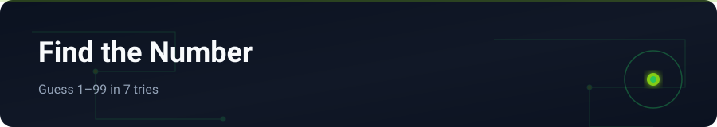

<div align="center">



</div>

# Find the Number Game

Number guessing game: computer picks 1–99, player has 7 attempts with higher/lower hints.

---

## English


### Features

- Random number between 1 and 99
- 7 attempts with higher / lower hints
- Input validation and replay option
- Clean console Python structure

### Stack

Python

### Getting started

```bash
git clone https://github.com/yasinfallahati/Find-the-number-game.git
cd Find-the-number-game
python "Find the number game.py"
```

---

## فارسی

### بازی پیدا کردن عدد

حدس عدد بین ۱ تا ۹۹ در هفت فرصت با راهنمای بالاتر/پایین‌تر.


### امکانات

- عدد تصادفی بین ۱ تا ۹۹
- ۷ تلاش با راهنمای بالاتر / پایین‌تر
- اعتبارسنجی ورودی و امکان بازی مجدد
- ساختار تمیز کنسولی پایتون

### تکنولوژی‌ها

Python

### شروع کار

```bash
git clone https://github.com/yasinfallahati/Find-the-number-game.git
cd Find-the-number-game
python "Find the number game.py"
```

---

`#python` `#game` `#console` `#beginner`
