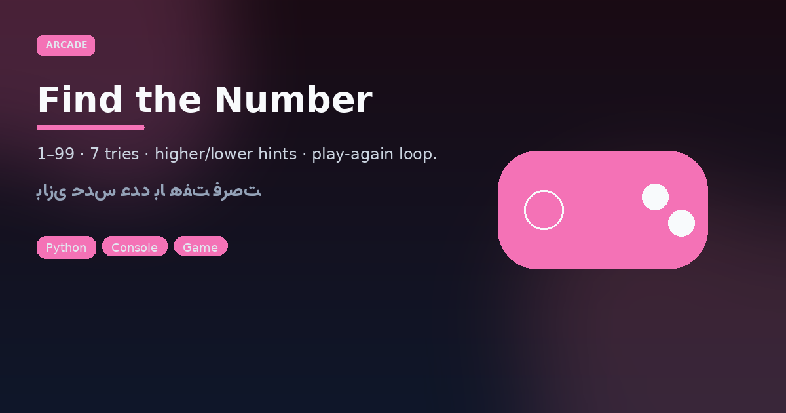

<pre align="center">
╔══════════════════════════════════════╗
║     🎮  FIND THE NUMBER  🎮          ║
║     1–99 · 7 tries · higher/lower    ║
╚══════════════════════════════════════╝
</pre>

<p align="center">
  
</p>

<p align="center">
  
  
  
</p>

<p align="center"><a href="#play">Play</a> · <a href="#rules">Rules</a> · <a href="#فارسی">فارسی</a></p>

## Play

```bash
python3 "Find the number game.py"
```

## Rules

1. Computer secretly picks an integer **1–99**.
2. You have **7** attempts.
3. After each miss: **Go higher** or **Go lower**.
4. Win early or reveal the number on game over — then `y` to replay.

Input validation rejects non-integers and out-of-range guesses without burning a try incorrectly (re-prompt path).

---

<a id="فارسی"></a>

## فارسی — بازی پیدا کردن عدد

یک بازی کنسولی ساده و تمیز: کامپیوتر عددی بین **۱ تا ۹۹** انتخاب می‌کند و شما **۷ فرصت** دارید. بعد از هر حدس اشتباه راهنمای «بالاتر» یا «پایین‌تر» می‌گیرید. در پایان می‌توانید با `y` دوباره بازی کنید.

### اجرا

```bash
python3 "Find the number game.py"
```

### قوانین کامل

| مورد | مقدار |
|------|--------|
| بازه | ۱ تا ۹۹ |
| فرصت | ۷ |
| بازخورد | بالاتر / پایین‌تر |
| تکرار | پرسش Play again؟ |

ایدهٔ خوب برای تمرین حلقه، `random`، و اعتبارسنجی ورودی در پایتون.
